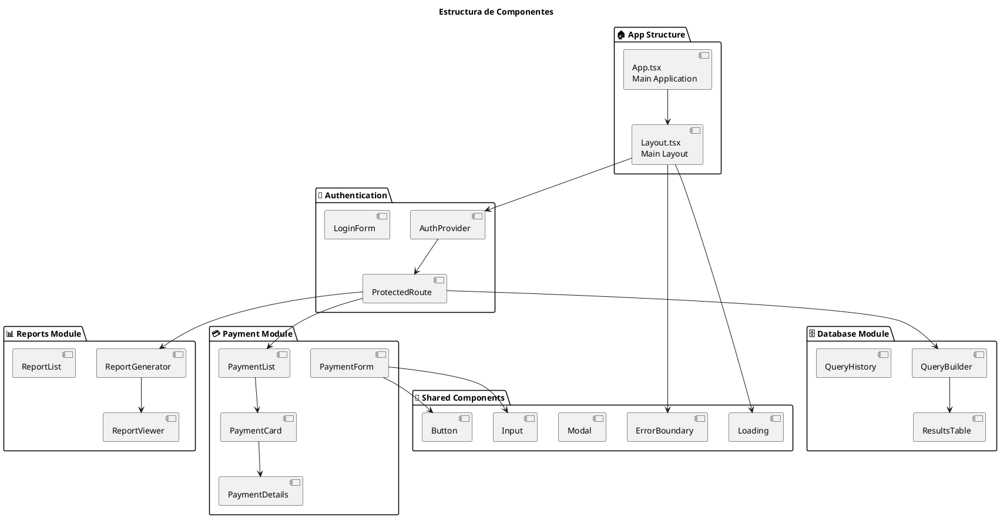
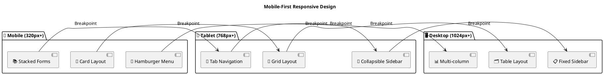
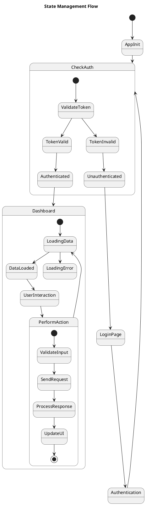
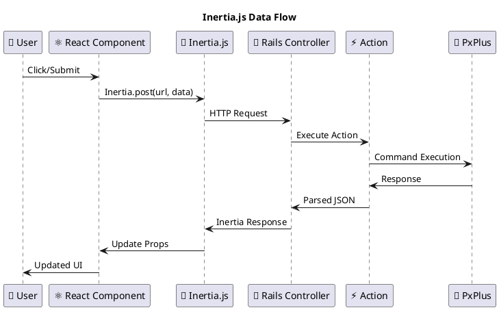
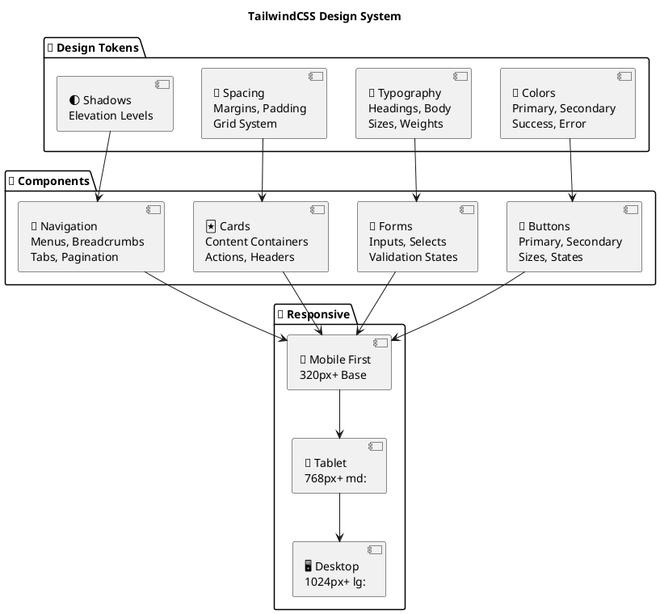

# Arquitectura Frontend - React + Inertia.js

## Estructura de Componentes



## Mobile-First Responsive Design



## State Management Flow



## Inertia.js Data Flow



## Component Props Flow

```plantuml
@startuml
title Component Props Flow

package "🖥️ Server-Side (Rails)" {
  [🎮 Controller] as Controller
  [⚡ Action] as Action
  [📊 Data from PxPlus] as Data
}

package "🎨 Client-Side (React)" {
  [📄 Page Component] as PageComponent
  [👶 Child Components] as ChildComponents
  [🏪 Local State] as LocalState
  
  package "🌐 Shared State" {
    [🔐 Auth Context] as AuthContext
    [🎨 Theme Context] as ThemeContext
  }
}

Data --> Action
Action --> Controller
Controller -->|Inertia Props| PageComponent
PageComponent -->|Props| ChildComponents
ChildComponents -->|State Updates| LocalState

AuthContext -->|Auth Data| PageComponent
ThemeContext -->|Theme Data| PageComponent

@enduml
```

## TailwindCSS Design System

