# Arquitectura Frontend - React + Inertia.js

## Estructura de Componentes

```mermaid
graph TD
    subgraph "App Structure"
        App[🏠 App.tsx<br/>Main Application]
        Layout[📐 Layout.tsx<br/>Main Layout]
        
        subgraph "Authentication"
            AuthProvider[🔐 AuthProvider]
            LoginForm[📝 LoginForm]
            ProtectedRoute[🛡️ ProtectedRoute]
        end
        
        subgraph "Payment Module"
            PaymentList[📋 PaymentList]
            PaymentForm[💳 PaymentForm]
            PaymentCard[🃏 PaymentCard]
            PaymentDetails[👁️ PaymentDetails]
        end
        
        subgraph "Database Module"
            QueryBuilder[🔧 QueryBuilder]
            ResultsTable[📊 ResultsTable]
            QueryHistory[📚 QueryHistory]
        end
        
        subgraph "Reports Module"
            ReportGenerator[📈 ReportGenerator]
            ReportViewer[👀 ReportViewer]
            ReportList[📋 ReportList]
        end
        
        subgraph "Shared Components"
            Button[🔘 Button]
            Input[📝 Input]
            Modal[🗔 Modal]
            Loading[⏳ Loading]
            ErrorBoundary[❌ ErrorBoundary]
        end
    end
    
    App --> Layout
    Layout --> AuthProvider
    AuthProvider --> ProtectedRoute
    ProtectedRoute --> PaymentList
    ProtectedRoute --> QueryBuilder
    ProtectedRoute --> ReportGenerator
    
    PaymentList --> PaymentCard
    PaymentCard --> PaymentDetails
    PaymentForm --> Input
    PaymentForm --> Button
    
    QueryBuilder --> ResultsTable
    ReportGenerator --> ReportViewer
    
    Layout --> ErrorBoundary
    Layout --> Loading
```

## Mobile-First Responsive Design

```mermaid
graph LR
    subgraph "Mobile (320px+)"
        MobileNav[🍔 Hamburger Menu]
        MobileCards[📱 Card Layout]
        MobileStack[📚 Stacked Forms]
    end
    
    subgraph "Tablet (768px+)"
        TabletSidebar[📑 Collapsible Sidebar]
        TabletGrid[🔲 Grid Layout]
        TabletTabs[📂 Tab Navigation]
    end
    
    subgraph "Desktop (1024px+)"
        DesktopSidebar[📋 Fixed Sidebar]
        DesktopTable[🗂️ Table Layout]
        DesktopMultiColumn[📊 Multi-column]
    end
    
    MobileNav -->|Breakpoint| TabletSidebar
    MobileCards -->|Breakpoint| TabletGrid
    MobileStack -->|Breakpoint| TabletTabs
    
    TabletSidebar -->|Breakpoint| DesktopSidebar
    TabletGrid -->|Breakpoint| DesktopTable
    TabletTabs -->|Breakpoint| DesktopMultiColumn
```

## State Management Flow

## Inertia.js Data Flow

```mermaid
sequenceDiagram
    participant User as 👤 User
    participant React as ⚛️ React Component
    participant Inertia as 🔄 Inertia.js
    participant Rails as 💎 Rails Controller
    participant Action as ⚡ Action
    participant PxPlus as 🏢 PxPlus
    
    User->>React: Click/Submit
    React->>Inertia: Inertia.post(url, data)
    Inertia->>Rails: HTTP Request
    Rails->>Action: Execute Action
    Action->>PxPlus: Command Execution
    PxPlus->>Action: Response
    Action->>Rails: Parsed JSON
    Rails->>Inertia: Inertia Response
    Inertia->>React: Update Props
    React->>User: Updated UI
```

## Component Props Flow

```mermaid
graph TD
    subgraph "Server-Side (Rails)"
        Controller[🎮 Controller]
        Action[⚡ Action]
        Data[📊 Data from PxPlus]
    end
    
    subgraph "Client-Side (React)"
        PageComponent[📄 Page Component]
        ChildComponents[👶 Child Components]
        LocalState[🏪 Local State]
        
        subgraph "Shared State"
            AuthContext[🔐 Auth Context]
            ThemeContext[🎨 Theme Context]
        end
    end
    
    Data --> Action
    Action --> Controller
    Controller -->|Inertia Props| PageComponent
    PageComponent -->|Props| ChildComponents
    ChildComponents -->|State Updates| LocalState
    
    AuthContext -->|Auth Data| PageComponent
    ThemeContext -->|Theme Data| PageComponent
```

## TailwindCSS Design System

```mermaid
graph LR
    subgraph "Design Tokens"
        Colors[🎨 Colors<br/>Primary, Secondary<br/>Success, Error]
        Typography[📝 Typography<br/>Headings, Body<br/>Sizes, Weights]
        Spacing[📏 Spacing<br/>Margins, Padding<br/>Grid System]
        Shadows[🌓 Shadows<br/>Elevation Levels]
    end
    
    subgraph "Components"
        Buttons[🔘 Buttons<br/>Primary, Secondary<br/>Sizes, States]
        Forms[📝 Forms<br/>Inputs, Selects<br/>Validation States]
        Cards[🃏 Cards<br/>Content Containers<br/>Actions, Headers]
        Navigation[🧭 Navigation<br/>Menus, Breadcrumbs<br/>Tabs, Pagination]
    end
    
    subgraph "Responsive"
        Mobile[📱 Mobile First<br/>320px+ Base]
        Tablet[📱 Tablet<br/>768px+ md:]
        Desktop[🖥️ Desktop<br/>1024px+ lg:]
    end
    
    Colors --> Buttons
    Typography --> Forms
    Spacing --> Cards
    Shadows --> Navigation
    
    Buttons --> Mobile
    Forms --> Mobile
    Cards --> Mobile
    Navigation --> Mobile
    
    Mobile --> Tablet
    Tablet --> Desktop
```

