# Diagrama de Arquitectura del Sistema

## Arquitectura General

```plantuml
@startuml
title Arquitectura General del Sistema

package "Internet" {
  [👤 Usuario] as User
}

package "Ubuntu Server" {
  package "Web Layer" {
    [🌐 Nginx\nReverse Proxy\nPort 80/443] as Nginx
  }
  
  package "Application Layer" {
    [💎 Rails App\nInertia.js + API\nPort 3000] as Rails
    [⚛️ React Frontend\nTailwindCSS\nSSR con Inertia] as React
  }
  
  package "File System" {
    [📄 .txt Files\n/tmp/pxplus_exchange] as TxtFiles
  }
  
  package "Legacy System" {
    [🏢 PxPlus 7.71\nExisting System] as PxPlus
  }
}

User -down-> Nginx : HTTPS Requests
Nginx -down-> Rails : Proxy Pass
Rails -right-> React : Inertia.js
Rails -down-> TxtFiles : Generate .txt
Rails -down-> PxPlus : Execute Commands
PxPlus -up-> TxtFiles : Response .txt
TxtFiles -up-> Rails : Parse to JSON

@enduml
```



## Flujo de Datos

```plantuml
@startuml
title Flujo de Datos

participant "👤 Usuario" as U
participant "🌐 Nginx" as N
participant "💎 Rails" as R
participant "📄 File System" as F
participant "🏢 PxPlus 7.71" as P

U -> N : Petición HTTPS
N -> R : Proxy request
R -> R : Validate JWT
R -> R : Action.call()
R -> F : Generate input.txt
R -> P : Execute command
P -> F : Write response.txt
F -> R : Read response
R -> R : Parse txt → JSON
R -> U : Inertia.js response

@enduml
```

## Stack Tecnológico

```plantuml
@startuml
title Stack Tecnológico

package "🎨 Frontend" {
  [React 18+] as React
  [TypeScript] as TS
  [TailwindCSS] as Tailwind
  [Inertia.js] as Inertia
  [Vite] as Vite
}

package "⚙️ Backend" {
  [Ruby on Rails 7+] as Rails
  [JWT Auth] as JWT
  [Actions Pattern] as Actions
  [Service Objects] as Services
  [Puma Server] as Puma
}

package "🏗️ Infrastructure" {
  [Ubuntu Server] as Ubuntu
  [Nginx] as Nginx
  [Let's Encrypt SSL] as SSL
  [GitHub] as GitHub
}

package "🏢 Legacy" {
  [PxPlus 7.71] as PxPlus
  [File Exchange] as Files
  [Command Execution] as Commands
}

React --> Inertia
TS --> React
Tailwind --> React
Inertia --> Rails
Vite --> React
Rails --> Actions
JWT --> Rails
Actions --> Services
Services --> Files
Puma --> Rails
Ubuntu --> Nginx
Nginx --> Rails
SSL --> Nginx
GitHub --> Ubuntu
PxPlus --> Commands
Files --> PxPlus
Commands --> Services

@enduml
```

