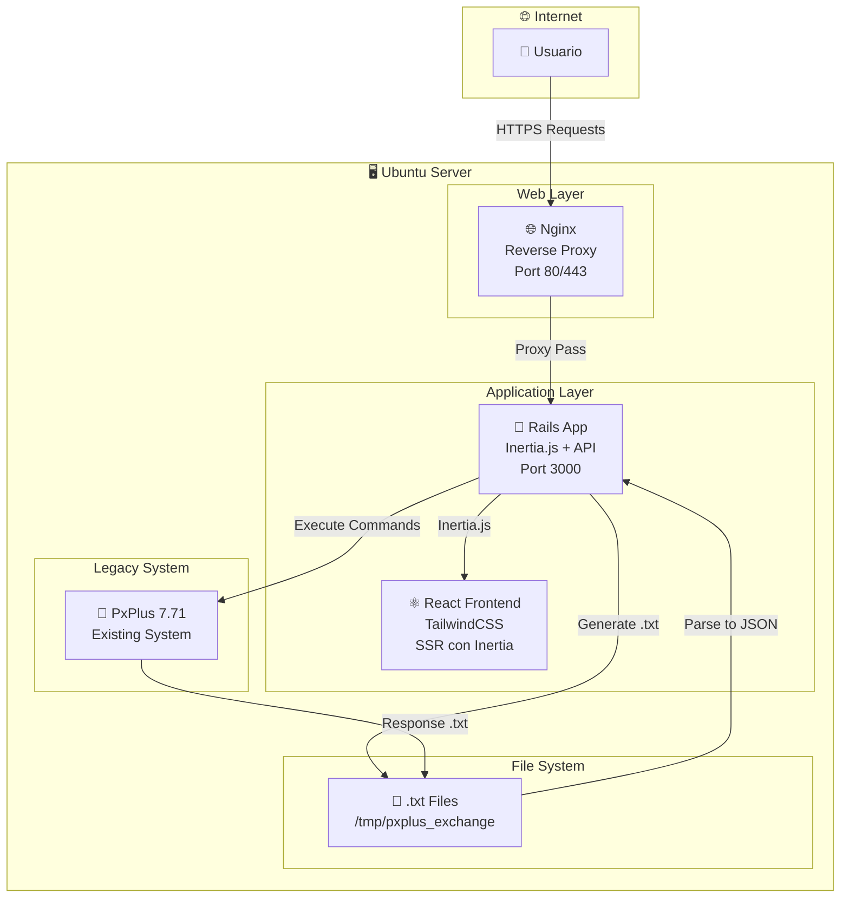
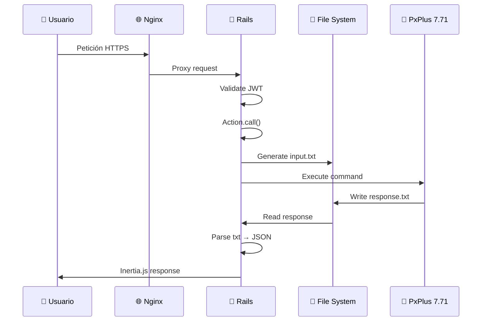
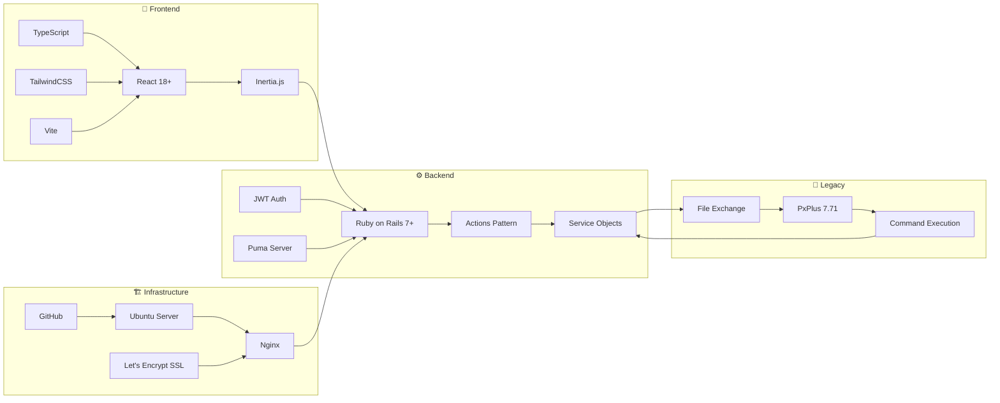

# Diagrama de Arquitectura del Sistema

## Arquitectura General

```mermaid
graph TB
    subgraph Internet["🌐 Internet"]
        User[👤 Usuario]
    end
    
    subgraph Server["🖥️ Ubuntu Server"]
        subgraph WebLayer["Web Layer"]
            Nginx[🌐 Nginx<br/>Reverse Proxy<br/>Port 80/443]
        end
        
        subgraph AppLayer["Application Layer"]
            Rails[💎 Rails App<br/>Inertia.js + API<br/>Port 3000]
            React[⚛️ React Frontend<br/>TailwindCSS<br/>SSR con Inertia]
        end
        
        subgraph FileSystem["File System"]
            TxtFiles[📄 .txt Files<br/>/tmp/pxplus_exchange]
        end
        
        subgraph Legacy["Legacy System"]
            PxPlus[🏢 PxPlus 7.71<br/>Existing System]
        end
    end
    
    User -->|HTTPS Requests| Nginx
    Nginx -->|Proxy Pass| Rails
    Rails -->|Inertia.js| React
    Rails -->|Generate .txt| TxtFiles
    Rails -->|Execute Commands| PxPlus
    PxPlus -->|Response .txt| TxtFiles
    TxtFiles -->|Parse to JSON| Rails
```

## Flujo de Datos

```mermaid
sequenceDiagram
    participant U as 👤 Usuario
    participant N as 🌐 Nginx
    participant R as 💎 Rails
    participant F as 📄 File System
    participant P as 🏢 PxPlus 7.71
    
    U->>N: Petición HTTPS
    N->>R: Proxy request
    R->>R: Validate JWT
    R->>R: Action.call()
    R->>F: Generate input.txt
    R->>P: Execute command
    P->>F: Write response.txt
    F->>R: Read response
    R->>R: Parse txt → JSON
    R->>U: Inertia.js response
```

## Stack Tecnológico

```mermaid
graph LR
    subgraph Frontend["🎨 Frontend"]
        React[React 18+]
        TS[TypeScript]
        Tailwind[TailwindCSS]
        Inertia[Inertia.js]
        Vite[Vite]
    end
    
    subgraph Backend["⚙️ Backend"]
        Rails[Ruby on Rails 7+]
        JWT[JWT Auth]
        Actions[Actions Pattern]
        Services[Service Objects]
        Puma[Puma Server]
    end
    
    subgraph Infrastructure["🏗️ Infrastructure"]
        Ubuntu[Ubuntu Server]
        Nginx[Nginx]
        SSL[Let's Encrypt SSL]
        GitHub[GitHub]
    end
    
    subgraph Legacy["🏢 Legacy"]
        PxPlus[PxPlus 7.71]
        Files[File Exchange]
        Commands[Command Execution]
    end
    
    React --> Inertia
    TS --> React
    Tailwind --> React
    Inertia --> Rails
    Vite --> React
    Rails --> Actions
    JWT --> Rails
    Actions --> Services
    Services --> Files
    Puma --> Rails
    Ubuntu --> Nginx
    Nginx --> Rails
    SSL --> Nginx
    GitHub --> Ubuntu
    PxPlus --> Commands
    Files --> PxPlus
    Commands --> Services
```