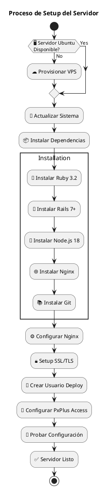
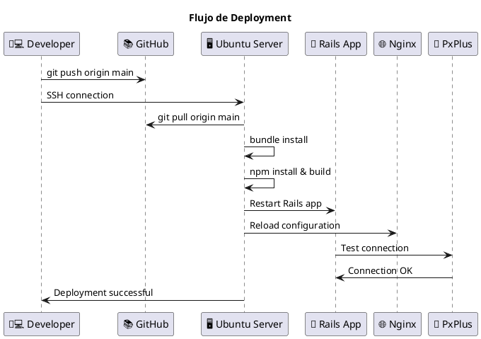
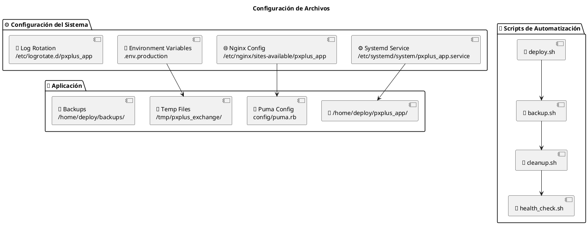
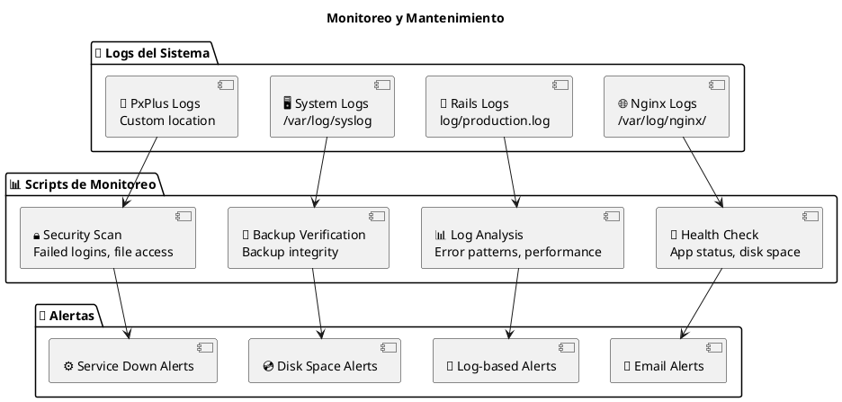
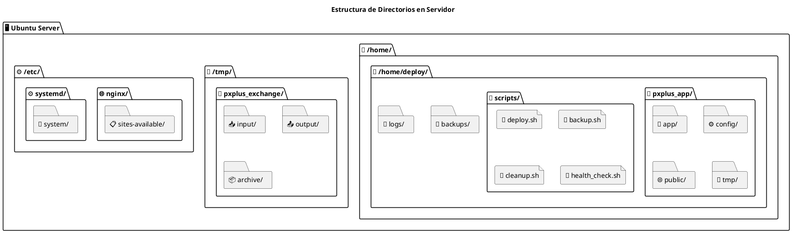
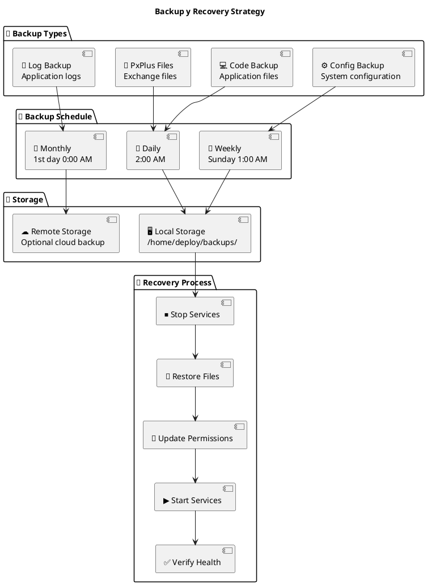

# Flujo de Deployment y Configuración

## Proceso de Setup del Servidor

## Flujo de Deployment

## Configuración de Archivos

## Monitoreo y Mantenimiento

## Estructura de Directorios en Servidor

## Backup y Recovery Strategy

