# Flujo de Deployment y Configuración

## Proceso de Setup del Servidor

```mermaid
flowchart TD
    Start([🚀 Inicio Setup]) --> CheckServer{🖥️ Servidor Ubuntu<br/>Disponible?}
    CheckServer -->|No| ProvisionServer[☁️ Provisionar VPS]
    CheckServer -->|Yes| UpdateSystem[🔄 Actualizar Sistema]
    ProvisionServer --> UpdateSystem
    
    UpdateSystem --> InstallDeps[📦 Instalar Dependencias]
    
    subgraph "Instalación de Software"
        InstallDeps --> Ruby[💎 Instalar Ruby 3.2]
        Ruby --> Rails[🚂 Instalar Rails 7+]
        Rails --> Node[📗 Instalar Node.js 18]
        Node --> Nginx[🌐 Instalar Nginx]
        Nginx --> Git[📚 Instalar Git]
    end
    
    Git --> ConfigNginx[⚙️ Configurar Nginx]
    ConfigNginx --> SetupSSL[🔒 Setup SSL/TLS]
    SetupSSL --> CreateUser[👤 Crear Usuario Deploy]
    CreateUser --> SetupPxPlus[🏢 Configurar PxPlus Access]
    SetupPxPlus --> TestSetup[🧪 Probar Configuración]
    TestSetup --> Ready[✅ Servidor Listo]
```

## Flujo de Deployment

```mermaid
sequenceDiagram
    participant Dev as 👨‍💻 Developer
    participant Git as 📚 GitHub
    participant Server as 🖥️ Ubuntu Server
    participant App as 💎 Rails App
    participant Nginx as 🌐 Nginx
    participant PxPlus as 🏢 PxPlus
    
    Dev->>Git: git push origin main
    Dev->>Server: SSH connection
    Server->>Git: git pull origin main
    Server->>Server: bundle install
    Server->>Server: npm install & build
    Server->>App: Restart Rails app
    Server->>Nginx: Reload configuration
    App->>PxPlus: Test connection
    PxPlus->>App: Connection OK
    Server->>Dev: Deployment successful
```

## Configuración de Archivos

```mermaid
graph TD
    subgraph "Configuración del Sistema"
        SystemdService[⚙️ Systemd Service<br/>/etc/systemd/system/pxplus_app.service]
        NginxConfig[🌐 Nginx Config<br/>/etc/nginx/sites-available/pxplus_app]
        EnvFile[🔐 Environment Variables<br/>.env.production]
        LogRotate[📝 Log Rotation<br/>/etc/logrotate.d/pxplus_app]
    end
    
    subgraph "Aplicación"
        AppDir[📁 /home/deploy/pxplus_app/]
        PumaConfig[🐾 Puma Config<br/>config/puma.rb]
        TempFiles[📄 Temp Files<br/>/tmp/pxplus_exchange/]
        BackupDir[💾 Backups<br/>/home/deploy/backups/]
    end
    
    subgraph "Scripts de Automatización"
        DeployScript[🚀 deploy.sh]
        BackupScript[💾 backup.sh]
        CleanupScript[🧹 cleanup.sh]
        HealthCheck[🏥 health_check.sh]
    end
    
    SystemdService --> AppDir
    NginxConfig --> PumaConfig
    EnvFile --> TempFiles
    DeployScript --> BackupScript
    BackupScript --> CleanupScript
    CleanupScript --> HealthCheck
```

## Monitoreo y Mantenimiento

```mermaid
flowchart LR
    subgraph "Logs del Sistema"
        NginxLogs[🌐 Nginx Logs<br/>/var/log/nginx/]
        RailsLogs[💎 Rails Logs<br/>log/production.log]
        SystemLogs[🖥️ System Logs<br/>/var/log/syslog]
        PxPlusLogs[🏢 PxPlus Logs<br/>Custom location]
    end
    
    subgraph "Scripts de Monitoreo"
        HealthCheck[🏥 Health Check<br/>App status, disk space]
        LogAnalysis[📊 Log Analysis<br/>Error patterns, performance]
        BackupCheck[💾 Backup Verification<br/>Backup integrity]
        SecurityScan[🔒 Security Scan<br/>Failed logins, file access]
    end
    
    subgraph "Alertas"
        EmailAlert[📧 Email Alerts]
        LogAlert[📝 Log-based Alerts]
        DiskAlert[💿 Disk Space Alerts]
        ServiceAlert[⚙️ Service Down Alerts]
    end
    
    NginxLogs --> HealthCheck
    RailsLogs --> LogAnalysis
    SystemLogs --> BackupCheck
    PxPlusLogs --> SecurityScan
    
    HealthCheck --> EmailAlert
    LogAnalysis --> LogAlert
    BackupCheck --> DiskAlert
    SecurityScan --> ServiceAlert
```

## Estructura de Directorios en Servidor

## Backup y Recovery Strategy

```mermaid
flowchart TD
    subgraph "Backup Types"
        CodeBackup[💻 Code Backup<br/>Application files]
        ConfigBackup[⚙️ Config Backup<br/>System configuration]
        FileBackup[📄 PxPlus Files<br/>Exchange files]
        LogBackup[📝 Log Backup<br/>Application logs]
    end
    
    subgraph "Backup Schedule"
        Daily[📅 Daily<br/>2:00 AM]
        Weekly[📅 Weekly<br/>Sunday 1:00 AM]
        Monthly[📅 Monthly<br/>1st day 0:00 AM]
    end
    
    subgraph "Storage"
        LocalStorage[🖥️ Local Storage<br/>/home/deploy/backups/]
        RemoteStorage[☁️ Remote Storage<br/>Optional cloud backup]
    end
    
    subgraph "Recovery Process"
        StopServices[⏹️ Stop Services]
        RestoreFiles[📁 Restore Files]
        UpdatePermissions[🔐 Update Permissions]
        StartServices[▶️ Start Services]
        VerifyHealth[✅ Verify Health]
    end
    
    CodeBackup --> Daily
    ConfigBackup --> Weekly
    FileBackup --> Daily
    LogBackup --> Monthly
    
    Daily --> LocalStorage
    Weekly --> LocalStorage
    Monthly --> RemoteStorage
    
    LocalStorage --> StopServices
    StopServices --> RestoreFiles
    RestoreFiles --> UpdatePermissions
    UpdatePermissions --> StartServices
    StartServices --> VerifyHealth
```

