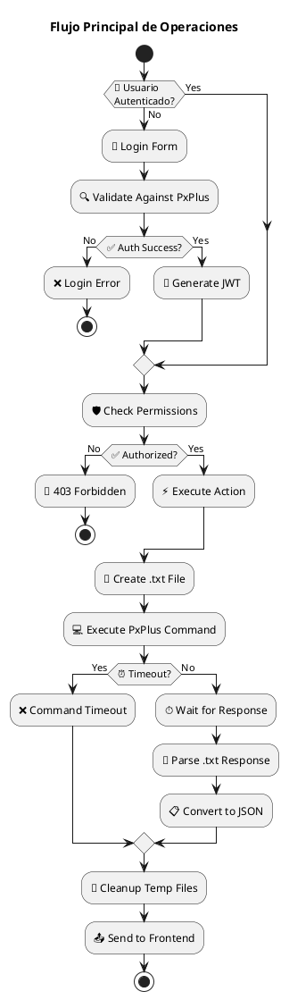
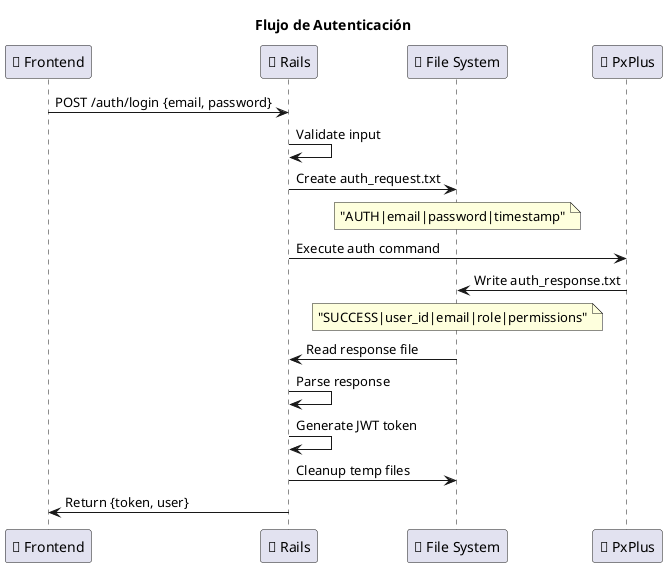
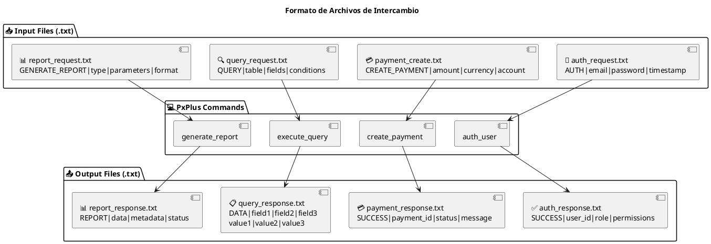
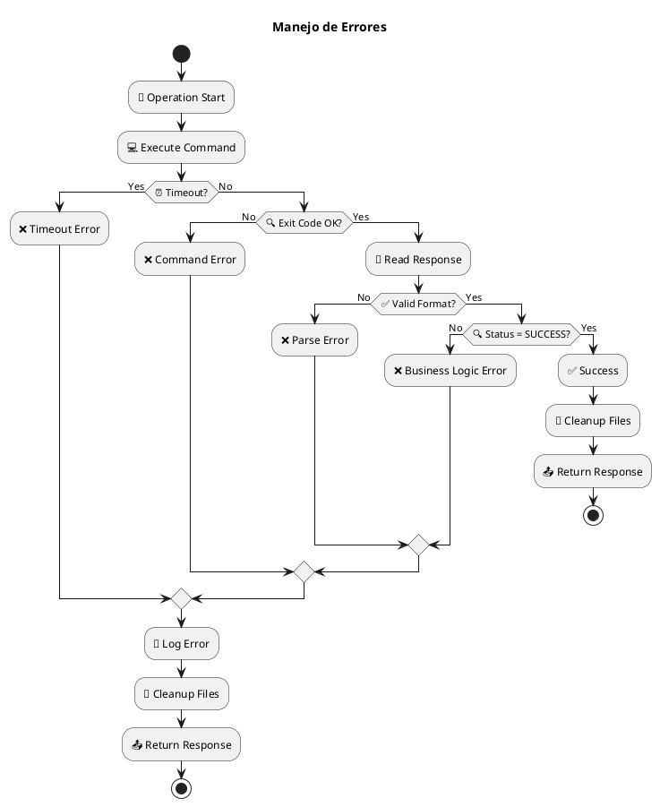

# Flujo de Integración con PxPlus

## Flujo Principal de Operaciones



## Flujo de Autenticación



## Flujo de Operaciones CRUD

```plantuml
@startuml
title Operaciones CRUD de Pagos

package "💳 Payment CRUD Flow" {
  rectangle "Create" {
    :Create Payment] as Create
    Create -> :📝 Generate payment_create.txt]
    :📝 Generate payment_create.txt] -> :💻 Execute create_payment command]
    :💻 Execute create_payment command] -> :📋 Parse response] as ParseCreate
  }
  
  rectangle "Read" {
    :Read Payment] as Read
    Read -> :📝 Generate payment_query.txt]
    :📝 Generate payment_query.txt] -> :💻 Execute query_payment command]
    :💻 Execute query_payment command] -> :📋 Parse response] as ParseRead
  }
  
  rectangle "Update" {
    :Update Payment] as Update
    Update -> :📝 Generate payment_update.txt]
    :📝 Generate payment_update.txt] -> :💻 Execute update_payment command]
    :💻 Execute update_payment command] -> :📋 Parse response] as ParseUpdate
  }
  
  rectangle "Delete" {
    :Delete Payment] as Delete
    Delete -> :📝 Generate payment_delete.txt]
    :📝 Generate payment_delete.txt] -> :💻 Execute delete_payment command]
    :💻 Execute delete_payment command] -> :📋 Parse response] as ParseDelete
  }
}

ParseCreate -> :📤 Return JSON to Frontend]
ParseRead -> :📤 Return JSON to Frontend]
ParseUpdate -> :📤 Return JSON to Frontend]
ParseDelete -> :📤 Return JSON to Frontend]

@enduml
```

## Formato de Archivos de Intercambio



## Manejo de Errores

