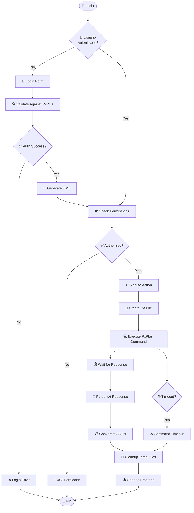
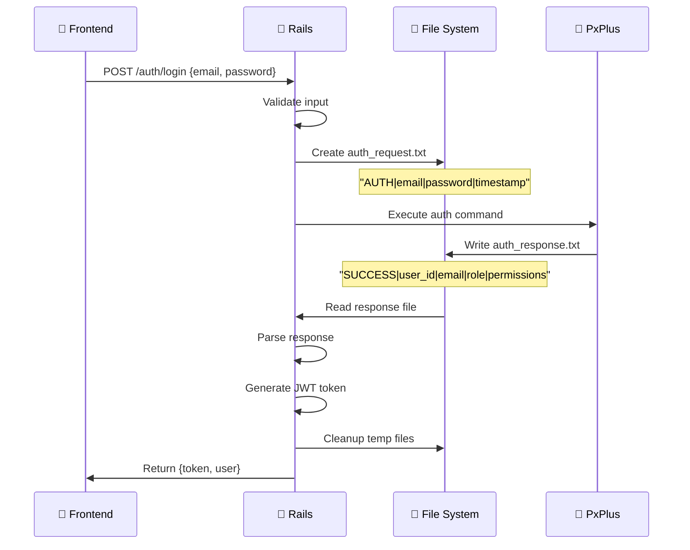
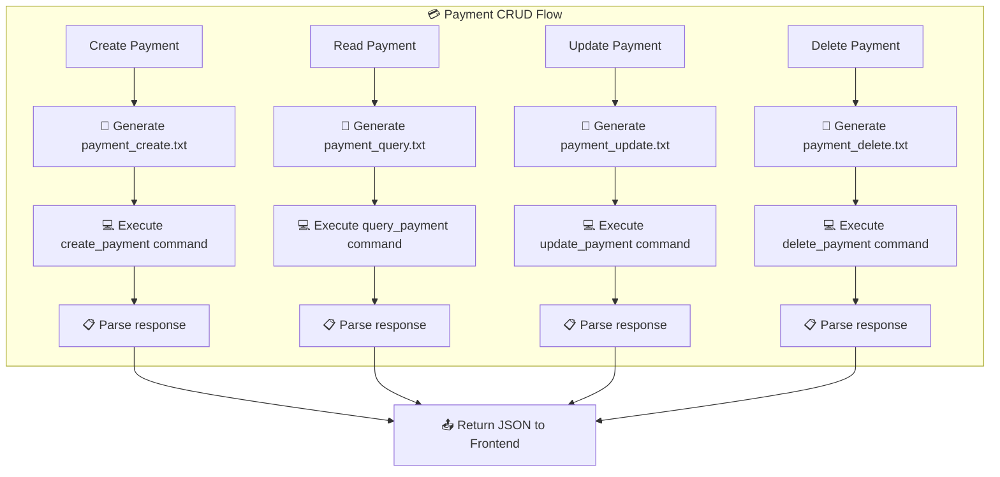
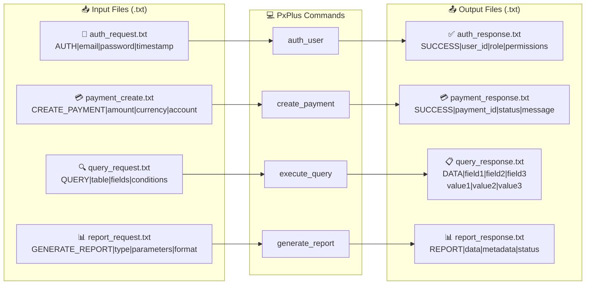
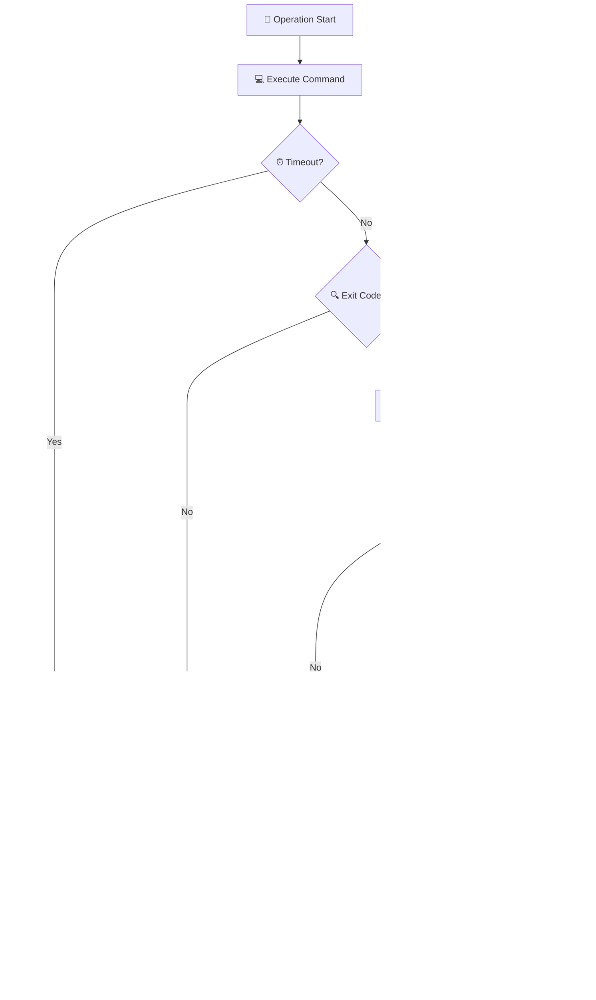

# Flujo de Integración con PxPlus

## Flujo Principal de Operaciones

```mermaid
flowchart TD
    Start([🚀 Inicio]) --> Auth{🔐 Usuario<br/>Autenticado?}
    Auth -->|No| Login[📝 Login Form]
    Login --> ValidateAuth[🔍 Validate Against PxPlus]
    ValidateAuth --> AuthSuccess{✅ Auth Success?}
    AuthSuccess -->|No| LoginError[❌ Login Error]
    AuthSuccess -->|Yes| GenerateJWT[🎫 Generate JWT]
    
    Auth -->|Yes| CheckPermissions[🛡️ Check Permissions]
    GenerateJWT --> CheckPermissions
    
    CheckPermissions --> AuthorizedAction{✅ Authorized?}
    AuthorizedAction -->|No| Forbidden[🚫 403 Forbidden]
    AuthorizedAction -->|Yes| ExecuteAction[⚡ Execute Action]
    
    ExecuteAction --> CreateFile[📝 Create .txt File]
    CreateFile --> ExecuteCommand[💻 Execute PxPlus Command]
    ExecuteCommand --> WaitResponse[⏱️ Wait for Response]
    WaitResponse --> ParseResponse[🔄 Parse .txt Response]
    ParseResponse --> ConvertJSON[📋 Convert to JSON]
    ConvertJSON --> CleanupFiles[🧹 Cleanup Temp Files]
    CleanupFiles --> SendResponse[📤 Send to Frontend]
    SendResponse --> End([🏁 Fin])
    
    LoginError --> End
    Forbidden --> End
    
    ExecuteCommand --> Timeout{⏰ Timeout?}
    Timeout -->|Yes| TimeoutError[❌ Command Timeout]
    TimeoutError --> CleanupFiles
```

## Flujo de Autenticación

```mermaid
sequenceDiagram
    participant F as 🎨 Frontend
    participant R as 💎 Rails
    participant FS as 📄 File System
    participant P as 🏢 PxPlus
    
    F->>R: POST /auth/login {email, password}
    R->>R: Validate input
    R->>FS: Create auth_request.txt
    Note over FS: "AUTH|email|password|timestamp"
    R->>P: Execute auth command
    P->>FS: Write auth_response.txt
    Note over FS: "SUCCESS|user_id|email|role|permissions"
    FS->>R: Read response file
    R->>R: Parse response
    R->>R: Generate JWT token
    R->>FS: Cleanup temp files
    R->>F: Return {token, user}
```

## Flujo de Operaciones CRUD

```mermaid
flowchart TD
    subgraph PaymentCRUD["💳 Payment CRUD Flow"]
        CreatePayment[Create Payment] --> GenPaymentFile[📝 Generate payment_create.txt]
        GenPaymentFile --> ExecCreateCmd[💻 Execute create_payment command]
        ExecCreateCmd --> ParseCreateResp[📋 Parse response]
        
        ReadPayment[Read Payment] --> GenQueryFile[📝 Generate payment_query.txt]
        GenQueryFile --> ExecQueryCmd[💻 Execute query_payment command]
        ExecQueryCmd --> ParseQueryResp[📋 Parse response]
        
        UpdatePayment[Update Payment] --> GenUpdateFile[📝 Generate payment_update.txt]
        GenUpdateFile --> ExecUpdateCmd[💻 Execute update_payment command]
        ExecUpdateCmd --> ParseUpdateResp[📋 Parse response]
        
        DeletePayment[Delete Payment] --> GenDeleteFile[📝 Generate payment_delete.txt]
        GenDeleteFile --> ExecDeleteCmd[💻 Execute delete_payment command]
        ExecDeleteCmd --> ParseDeleteResp[📋 Parse response]
    end
    
    ParseCreateResp --> ReturnJSON[📤 Return JSON to Frontend]
    ParseQueryResp --> ReturnJSON
    ParseUpdateResp --> ReturnJSON
    ParseDeleteResp --> ReturnJSON
```

## Formato de Archivos de Intercambio

```mermaid
graph LR
    subgraph Input["📥 Input Files (.txt)"]
        Auth["🔐 auth_request.txt<br/>AUTH|email|password|timestamp"]
        Payment["💳 payment_create.txt<br/>CREATE_PAYMENT|amount|currency|account"]
        Query["🔍 query_request.txt<br/>QUERY|table|fields|conditions"]
        Report["📊 report_request.txt<br/>GENERATE_REPORT|type|parameters|format"]
    end
    
    subgraph Commands["💻 PxPlus Commands"]
        AuthCmd[auth_user]
        PaymentCmd[create_payment]
        QueryCmd[execute_query]
        ReportCmd[generate_report]
    end
    
    subgraph Output["📤 Output Files (.txt)"]
        AuthResp["✅ auth_response.txt<br/>SUCCESS|user_id|role|permissions"]
        PaymentResp["💳 payment_response.txt<br/>SUCCESS|payment_id|status|message"]
        QueryResp["📋 query_response.txt<br/>DATA|field1|field2|field3<br/>value1|value2|value3"]
        ReportResp["📊 report_response.txt<br/>REPORT|data|metadata|status"]
    end
    
    Auth --> AuthCmd
    Payment --> PaymentCmd
    Query --> QueryCmd
    Report --> ReportCmd
    
    AuthCmd --> AuthResp
    PaymentCmd --> PaymentResp
    QueryCmd --> QueryResp
    ReportCmd --> ReportResp
```

## Manejo de Errores

```mermaid
flowchart TD
    Operation[🔄 Operation Start] --> ExecuteCmd[💻 Execute Command]
    ExecuteCmd --> CheckTimeout{⏰ Timeout?}
    CheckTimeout -->|Yes| TimeoutError[❌ Timeout Error]
    CheckTimeout -->|No| CheckExitCode{🔍 Exit Code OK?}
    
    CheckExitCode -->|No| CommandError[❌ Command Error]
    CheckExitCode -->|Yes| ReadResponse[📖 Read Response]
    
    ReadResponse --> ValidateResponse{✅ Valid Format?}
    ValidateResponse -->|No| ParseError[❌ Parse Error]
    ValidateResponse -->|Yes| CheckStatus{🔍 Status = SUCCESS?}
    
    CheckStatus -->|No| BusinessError[❌ Business Logic Error]
    CheckStatus -->|Yes| Success[✅ Success]
    
    TimeoutError --> LogError[📝 Log Error]
    CommandError --> LogError
    ParseError --> LogError
    BusinessError --> LogError
    
    LogError --> CleanupFiles[🧹 Cleanup Files]
    Success --> CleanupFiles
    CleanupFiles --> ReturnResponse[📤 Return Response]
```