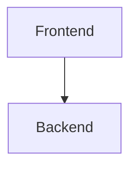

# Diagramas del Proyecto

Este directorio contiene todos los diagramas del proyecto en dos formatos:

## 📊 PlantUML (carpeta `plantuml/`)

Los diagramas PlantUML se renderizan automáticamente en GitHub usando el proxy de PlantUML.

**Archivos disponibles:**
- `arquitectura.puml` - Diagrama de arquitectura del sistema
- `flujo-comunicacion.puml` - Secuencia de comunicación entre componentes  
- `cronograma.puml` - Cronograma de desarrollo del proyecto

**Cómo usar:**
```markdown

```

**Ejemplo:**
```markdown

```

## 🧜‍♀️ Mermaid (carpeta `mermaid/`)

Los diagramas Mermaid se renderizan nativamente en GitHub dentro de archivos `.md`.

**Archivos disponibles:**
- `arquitectura.md` - Diagrama de arquitectura del sistema
- `flujo-comunicacion.md` - Secuencia de comunicación entre componentes
- `cronograma.md` - Cronograma de desarrollo del proyecto

**Cómo usar:**
Simplemente incluye el código Mermaid en un bloque de código:
````markdown

````

## 🔄 Actualización de diagramas

Para actualizar los diagramas:

1. **PlantUML**: Edita los archivos `.puml` y haz commit - se actualizarán automáticamente
2. **Mermaid**: Edita los archivos `.md` directamente en GitHub o localmente

## 📋 Ventajas de cada formato

| Característica | PlantUML | Mermaid |
|---|---|---|
| Renderizado en GitHub | ✅ Via proxy | ✅ Nativo |
| Sintaxis | Más potente | Más simple |
| Tipos de diagramas | Extenso | Limitado pero suficiente |
| Velocidad de carga | Depende del proxy | Instantáneo |
| Edición online | No recomendado | ✅ GitHub editor |