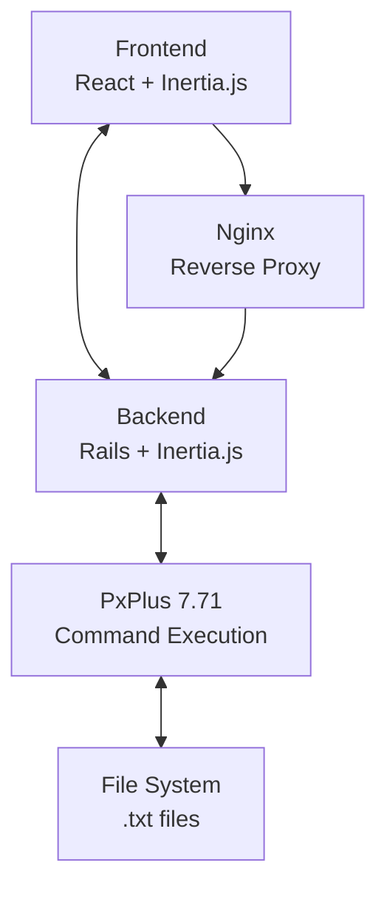

# Diagrama de Arquitectura

```mermaid
graph TB
    A[Frontend<br/>React + Inertia.js] <--> B[Backend<br/>Rails + Inertia.js]
    B <--> C[PxPlus 7.71<br/>Command Execution]
    A --> D[Nginx<br/>Reverse Proxy]
    D --> B
    C <--> E[File System<br/>.txt files]
```