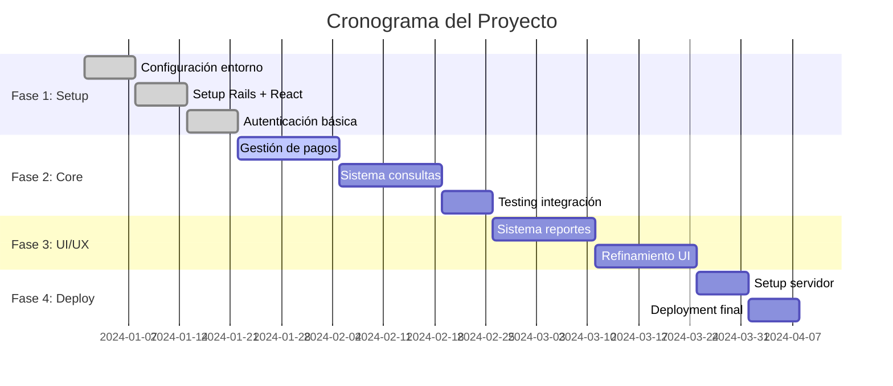

# Cronograma de Desarrollo

```mermaid
gantt
    title Cronograma del Proyecto
    dateFormat  YYYY-MM-DD
    section Fase 1: Setup
    Configuración entorno    :done, config, 2024-01-01, 1w
    Setup Rails + React      :done, setup, after config, 1w
    Autenticación básica     :done, auth, after setup, 1w
    
    section Fase 2: Core
    Gestión de pagos         :active, pagos, after auth, 2w
    Sistema consultas        :consultas, after pagos, 2w
    Testing integración      :testing, after consultas, 1w
    
    section Fase 3: UI/UX
    Sistema reportes         :reportes, after testing, 2w
    Refinamiento UI          :ui, after reportes, 2w
    
    section Fase 4: Deploy
    Setup servidor           :servidor, after ui, 1w
    Deployment final         :deploy, after servidor, 1w
```