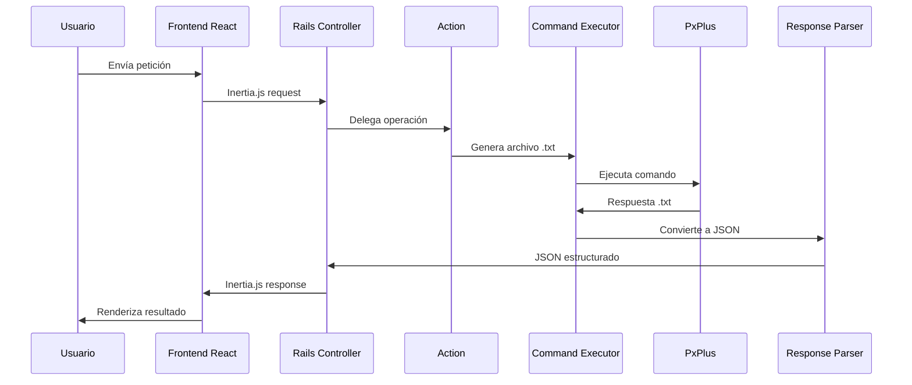

# Flujo de Comunicación

```mermaid
sequenceDiagram
    participant U as Usuario
    participant F as Frontend React
    participant C as Rails Controller
    participant A as Action
    participant E as Command Executor
    participant P as PxPlus
    participant R as Response Parser

    U->>F: Envía petición
    F->>C: Inertia.js request
    C->>A: Delega operación
    A->>E: Genera archivo .txt
    E->>P: Ejecuta comando
    P->>E: Respuesta .txt
    E->>R: Convierte a JSON
    R->>C: JSON estructurado
    C->>F: Inertia.js response
    F->>U: Renderiza resultado
```